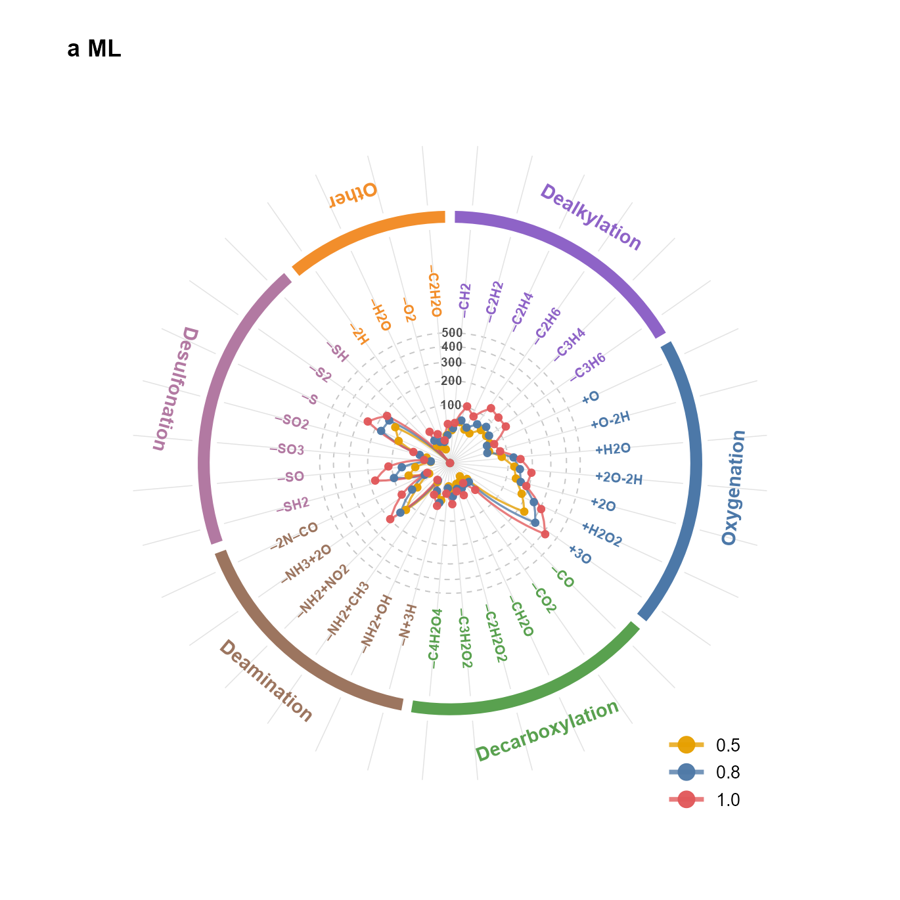
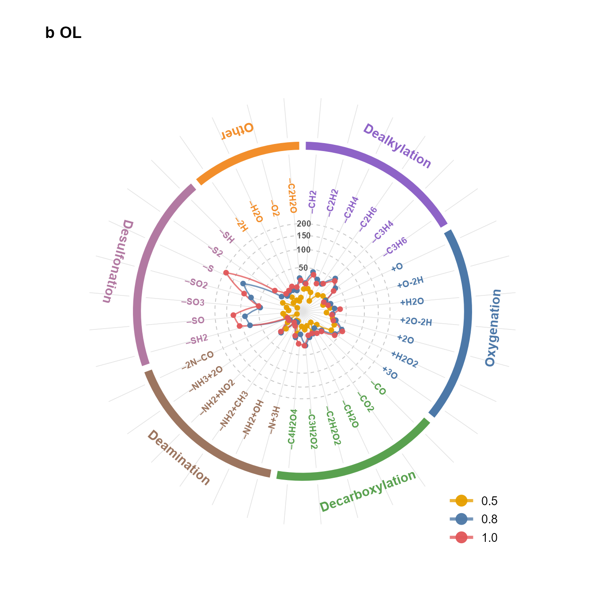

# FT-ICR DOM Analysis Skills

这个仓库保存用于 FT-ICR MS / DOM 数据处理的 Codex skills。当前包含多个主要能力：

1. `$fticr-dom-analysis`：给分子式表格补充分子性质、VK 分类、PMD/Gephi 分析文件。
2. `$vk-figure`：从含 `O/C`、`H/C`、`RI` 的样品 CSV 文件夹生成论文级 Van Krevelen RI 合并图。
3. `$group-vk-figure`：从 Group/VK 分类汇总表生成并排的堆叠柱状图，统计平行样品平均 RI (%)。
4. `$PMD-Radar plots`：从 PMD/linkage 的 precursor-product reaction edge 表生成带外圈反应分类条带的 Nature 风格环形雷达图。

## 1. 分子性质分析：`$fticr-dom-analysis`

用途：处理 FT-ICR MS / DOM 分子式表格，保留原始列，并追加分子性质分析结果。

主要输出列：

```text
ΔG0cox
λ
VK
(DBE-O)/C
```

典型调用：

```text
用 $fticr-dom-analysis 处理这个 FT-ICR MS 表格
```

脚本位置：

```text
scripts/molecular_property_analysis.py
scripts/molecular_PMD_analysis.py
scripts/gephi_analysis.py
```

命令示例：

```bash
python scripts/molecular_property_analysis.py input.xlsx output.xlsx
python scripts/molecular_property_analysis.py input.csv output.csv
python scripts/molecular_PMD_analysis.py processed
python scripts/gephi_analysis.py processed --clean
```

## 2. VK 绘图：`$vk-figure`

用途：当你有一批类似 `L10consensus_vk.csv` 这样的样品文件，每个文件中包含：

```text
O/C
H/C
RI
```

就可以调用 `$vk-figure` 自动完成 RI 分档检查、颜色分箱、VK 区域虚线、横向 RI 图例、合并图排版，并输出 **Adobe Illustrator 友好版** 文件。

典型调用：

```text
用 $vk-figure 读取这个文件夹，先检查 RI 分布并推荐分箱，然后按我选择的分箱画 VK 合并图
```

### 关键工作流

第一步：先检查 RI 分布，不直接画图。

```bash
Rscript skills/vk-figure/scripts/vk_figure_workflow.R --input 输入文件夹 --mode check
```

这一步会输出：

```text
输入文件夹/vk_figure_outputs/RI_classification_check/RI_quantiles_by_sample.csv
输入文件夹/vk_figure_outputs/RI_classification_check/candidate_bin_counts_by_sample.csv
输入文件夹/vk_figure_outputs/RI_classification_check/candidate_bin_counts_overall.csv
```

看这些表后，选择合适的 RI 分箱。默认候选包括：

```text
raw8              直接用原始 RI，8 档，适合当前 VK 图
raw6              直接用原始 RI，6 档，图例更简洁
original9         直接用原始 RI 套旧 9 档，容易过度集中在最低档
RIx10_original9   先 RI×10，再套旧 9 档
```

第二步：按选择的分箱画图。

```bash
Rscript skills/vk-figure/scripts/vk_figure_workflow.R --input 输入文件夹 --mode plot --scheme raw8
```

如果你想指定样品顺序：

```bash
Rscript skills/vk-figure/scripts/vk_figure_workflow.R --input 输入文件夹 --mode plot --scheme raw8 --order L10consensus_vk,L114consensus_vk,L130consensus_vk,L138consensus_vk,L20consensus_vk,L22consensus_vk,L25consensus_vk,L28consensus_vk
```

如果你想使用自定义 breaks 和 labels：

```bash
Rscript skills/vk-figure/scripts/vk_figure_workflow.R ^
  --input 输入文件夹 ^
  --mode plot ^
  --breaks "-Inf,0.00002,0.00004,0.00006,0.00010,0.00020,0.00050,0.001,Inf" ^
  --labels "<0.00002|[0.00002,0.00004)|[0.00004,0.00006)|[0.00006,0.00010)|[0.00010,0.00020)|[0.00020,0.00050)|[0.00050,0.001)|>=0.001"
```

注意：`labels` 之间用 `|` 分隔，因为区间标签里面本身有逗号。

### VK-figure 的绘图规范

`$vk-figure` 默认会按这次最终版的风格输出：

- 样品名直接使用表格文件名，不自动做 ML/OL 重命名。
- 根据 `RI` 做颜色分档，并先输出分箱统计供你选择。
- 使用 Nature 风格 RI 配色。
- 使用紧凑横向 RI 色带图例，放在合并图上方。
- 每个小图右下角写 `n=` 数量。
- 每行第一个面板外侧添加 `a`、`b` 等面板标注。
- 点层栅格化为 600 dpi，文字、坐标轴、虚线、边框和图例仍保持矢量。
- 输出文件一定是 Illustrator 友好版，避免 Adobe Illustrator 打开时特别卡。

### VK-figure 最终版字号

当前最终版图的推荐字号如下，下次复现或微调时优先按这个规格检查：

```text
坐标标题 O/C、H/C：18 pt
坐标刻度数字：14 pt
图中样品名：16 pt
右下角 n= 数量：16 pt
图例刻度数字：14 pt
图例右侧 RI (%) 和 ×10^-3：14 pt
左侧 a/b 面板标注：27 pt
```

### VK-figure 输出文件

默认输出目录：

```text
输入文件夹/vk_figure_outputs
```

主要文件：

```text
combined_vk_RI_AI_friendly.pdf
combined_vk_RI_AI_friendly.svg
combined_vk_RI_AI_friendly.png
combined_vk_RI_AI_friendly.tiff
all_samples_RI_bin_counts.csv
每个样品_RI_bin_counts.csv
```

建议在 Adobe Illustrator 中优先打开：

```text
combined_vk_RI_AI_friendly.pdf
```

如果仍然卡，可以打开 SVG，或者用 PNG/TIFF 作为排版参考。

## 3. Group/VK 堆叠柱状图：`$group-vk-figure`

用途：当你已经把 DOM 数据按 `Group` 和 `VK` 分类统计好，并得到包含 `Sample`、`Dimension`、`Category`、`RI sum` 的汇总表时，可以调用 `$group-vk-figure` 绘制论文用的两联堆叠柱状图。

图形结构：

```text
左图：Group 分类堆叠柱状图
右图：VK 分类堆叠柱状图
```

三个平行样品会自动取平均，例如：

```text
ML-0-1、ML-0-2、ML-0-3 取平均后显示为 ML-0
OL-1-1、OL-1-2、OL-1-3 取平均后显示为 OL-1
```

典型调用：

```text
用 $group-vk-figure 读取这个 Group/VK 汇总表，按前面确定的格式画并排堆叠柱状图
```

命令示例：

```bash
Rscript skills/group-vk-figure/scripts/group_vk_stacked_figure.R --input-summary 输入文件.xlsx
```

指定输出目录和文件名前缀：

```bash
Rscript skills/group-vk-figure/scripts/group_vk_stacked_figure.R ^
  --input-summary 输入文件.xlsx ^
  --output-dir 输出文件夹 ^
  --prefix DOM_Group_VK_ML_OL_stacked
```

### group-vk-figure 图形规格

```text
画布宽度：16.93 in
画布高度：5.64 in
布局：一排两个图，Group 在左，VK 在右
Y 轴标题：RI (%)
Y 轴范围：0-100
Y 轴刻度：0、25、50、75、100
坐标标题字号：18 pt，加粗
坐标刻度数字字号：14 pt
横坐标样品名称字号：14 pt
图例文字字号：10 pt
图例色块：正方形，3.4 mm × 3.4 mm
柱子宽度：0.68
面板边框：黑色，0.70 pt
柱子分段边线：白色，0.18 pt
```

图上不显示 `Group` 或 `VK` 的面板标题，分类信息只通过各自图例表达。

### Group 图例顺序和配色

```text
CHO     #5B8DB8
CHON    #D89070
CHONS   #78A978
CHOS    #C6A15B
Others  #B8B8B8
```

Group 图例为一排。

### VK 图例顺序和配色

```text
Lipids                         #7FA6C9
Aliphatic/proteins             #E2B47A
Lignin/CRAM-like structures    #8F8CC0
Carbohydrates                  #86B8B2
Unsaturated hydrocarbons       #A7C8A2
Aromatic structures            #C78282
Tannin                         #B996C6
Others                         #B7B7B7
```

VK 图例为两排，文字不换行，图例放在 VK 柱状图上方。

### group-vk-figure 输出文件

默认输出目录：

```text
输入文件所在目录/Group_VK_RI_stacked_figures
```

主要文件：

```text
<prefix>.svg
<prefix>.pdf
<prefix>.tiff
<prefix>.png
<prefix>_source_data.csv
```

脚本运行结束会输出 QA 表，每个样品的 Group 和 VK 堆叠总和应接近 100。

## R 依赖

`$vk-figure` 和 `$group-vk-figure` 需要以下 R 包：

```r
install.packages(c("readxl", "readr", "dplyr", "tidyr", "ggplot2", "patchwork", "ragg", "svglite", "ggrastr"))
```

其中 `ggrastr` 用于 `$vk-figure` 只栅格化散点层，这是 Illustrator 友好版的关键。

## 4. Venn + Shared VK + Violin 组合图：`$2-ven-violin`

用途：把已经完成的 **Venn diagram**、**shared Formula 的 VK 散点图** 和 **显著分子特性 violin plot** 合并成一张最终论文图。

这个 skill 对应当前最终图结构：

```text
a  Venn diagram        b  Shared VK scatter

c  MW      d  DBE      e  O/C      f  H/C
g  N/C     h  S/C      i  AImod    j  NOSC
```

### 什么时候调用

当你已经完成以下三个步骤后，可以直接调用 `$2-ven-violin`：

1. ML-0 和 OL-0 的 shared/unique Formula Venn 统计；
2. 5662 个 shared Formula 的 VK 散点图源数据；
3. ML-0 vs OL-0 分子特性的 Wilcoxon 检验和 RI 加权平均结果。

典型调用方式：

```text
用 $2-ven-violin 读取这个 01汇总筛选3 文件夹，把 Venn、shared VK 和 violin plots 合并成最终图。
```

### 输入目录要求

把 `--input` 指向类似 `01汇总筛选3` 的父目录。该目录下需要包含：

```text
01汇总筛选3/
  Venn_ML0_OL0/
    ML0_OL0_venn_counts.csv

  Shared_VK_scatter/
    Shared_5662_VK_scatter_source_data.csv

  Wilcoxon rank-sum test/
    ML0_OL0_final_property_values_long_format.csv
    ML0_OL0_RI_weighted_mean_Wilcoxon_summary.csv
```

### 运行命令

```bash
Rscript skills/2-ven-violin/scripts/2_ven_violin_workflow.R --input 输入文件夹
```

也可以指定输出文件夹、文件名前缀和分辨率：

```bash
Rscript skills/2-ven-violin/scripts/2_ven_violin_workflow.R ^
  --input 输入文件夹 ^
  --output 输出文件夹 ^
  --prefix ML0_OL0_shared_VK_violin_combined ^
  --dpi 600
```

### 最终图设置

当前最终版会按以下规则绘制：

- `a` 图为 ML 和 OL 的 Venn diagram；
- `b` 图为 5662 个 shared Formula 的 VK 散点图，不考虑 RI 颜色分布；
- `c-j` 图为显著分子特性的 violin plots；
- violin 图横坐标只显示 `ML` 和 `OL`，不显示 `ML-0` 和 `OL-0`；
- violin 图顶部不显示 FDR p 值，而是显示对应 RI 加权平均值，例如 `DBEwa=6.419`、`DBEwa=7.530`；
- panel label 使用 `a, b, c ... j`，不加括号；
- `a` 图圆的直径按最终版调到约为 `b` 图纵坐标长度的 4/5；
- `b` 图的纵坐标与下面 `e` 图所在列对齐；
- 输出 PDF、PNG 和 TIFF，其中 PNG/TIFF 为 600 dpi。

### 输出文件

默认输出目录：

```text
输入文件夹/Combined_shared_VK_violin_figure
```

主要输出文件：

```text
ML0_OL0_shared_VK_violin_combined.pdf
ML0_OL0_shared_VK_violin_combined.png
ML0_OL0_shared_VK_violin_combined.tiff
```

建议论文排版或 Adobe Illustrator 后期编辑时优先使用：

```text
ML0_OL0_shared_VK_violin_combined.pdf
```

### R 依赖

```r
install.packages(c("ggplot2", "patchwork", "ragg", "ggrastr"))
```
## 4. UpSet 交集图：`$upset`

用途：从已经完成去重和三平行稳定筛选的 FT-ICR MS DOM 分子式文件中，分别绘制 ML 和 OL 在不同预臭氧剂量下的 UpSet diagram。

这个 skill 适合整理类似 Fig. S7 的图：

```text
左侧：每个剂量组的 formula count
右上：exclusive intersection size，灰色柱状图
右下：combination matrix，行背景、圆点和连接线与对应剂量颜色匹配
```

默认读取 8 个条件文件：

```text
ML-0.csv
ML-0.5.csv
ML-0.8.csv
ML-1.csv
OL-0.csv
OL-0.5.csv
OL-0.8.csv
OL-1.csv
```

也支持 `.xlsx` 和 `.xls`。文件中需要有分子式列，例如 `Formula`、`Molecular Formula`、`molecular_formula` 或 `Assigned formula`。

### upset 的颜色规则

ML：

```text
1   = #E5086A
0.5 = #D35F27
0.8 = #604E98
0   = #046586
```

OL：

```text
1   = #E41A1C
0.8 = #6BAF45
0   = #F07F7F
0.5 = #F5A623
```

右侧 intersection bar 统一使用灰色；底部 matrix 的背景色降低饱和度，圆点和连接线与对应剂量颜色保持一致。

### 典型调用

在 Codex 中可以直接说：

```text
调用 upset，读取这个文件夹，帮我画 ML 和 OL 的 UpSet 图
```

命令行示例：

```bash
Rscript skills/upset/scripts/make_upset_nature_matched.R \
  --input_dir 输入文件夹 \
  --output_dir 输出文件夹
```

Windows PowerShell 示例：

```powershell
Rscript skills/upset/scripts/make_upset_nature_matched.R `
  --input_dir "C:\Users\周周\Desktop\NCFT\02DOM数据处理\01汇总筛选3" `
  --output_dir "C:\Users\周周\Desktop\NCFT\02DOM数据处理\01汇总筛选3\UpSet_nature_matched"
```

### upset 输出文件

```text
ML_upset_nature_matched.pdf
ML_upset_nature_matched.png
OL_upset_nature_matched.pdf
OL_upset_nature_matched.png
upset_nature_matched_set_size_audit.csv
ML_upset_nature_matched_intersections.csv
OL_upset_nature_matched_intersections.csv
```

其中 PDF 为 Illustrator 友好版，PNG 为 600 dpi；CSV 文件用于核查 set size 和 intersection size，也可用于整理投稿 source data。
## 5. VK 边际分布图：`$VK-marginal distribution`

用途：从 precursor、product、resistant 三类分子式文件中，绘制论文风格的 “Van Krevelen + marginal distribution” 图。适合生成类似 Fig. S8 的 2 × 3 总图。

最终图预览：


输入文件夹通常包含 6 个 Excel 文件：

```text
final_classification_for_analysis_ML0 vs. 0.5.xlsx
final_classification_for_analysis_ML0 vs. 0.8.xlsx
final_classification_for_analysis_ML0 vs. 1.xlsx
final_classification_for_analysis_OL0 vs. 0.5.xlsx
final_classification_for_analysis_OL0 vs. 0.8.xlsx
final_classification_for_analysis_OL0 vs. 1.xlsx
```

每个文件需要包含：

```text
final_precursor
final_product
final_resistant
```

每个 sheet 至少包含：

```text
O/C
H/C
```

典型调用：

```text
调用 VK-marginal distribution，读取这个文件夹，帮我画 Fig. S8 这种 VK 边际分布图
```

命令行示例：

```bash
Rscript skills/vk-marginal-distribution/scripts/vk_marginal_distribution.R \
  --input_dir 输入文件夹 \
  --output_dir 输出文件夹 \
  --prefix Fig_S8
```

输出文件包括：

```text
Fig_S8_VK_marginal_combined.pdf
Fig_S8_VK_marginal_combined.png
Fig_S8_stage_counts.csv
Fig_S8_caption.txt
```

其中 PDF 为 Illustrator 友好版，PNG 为 600 dpi。

## 6. PMD 反应雷达图：`$PMD-Radar plots`

用途：从 PMD/linkage 分析得到的 precursor-product reaction edge 表中，绘制 Nature 风格的环形反应雷达图。该图适合比较 ML/OL 在 0.5、0.8、1.0 g O3·(g DOC)–1 下不同反应路径的匹配数量，并在最外圈用彩色条带标注反应大类。

最终图预览：





输入文件通常为：

```text
reaction_results/all_network_edge.csv
```

至少需要包含以下列：

```text
Leachate
Dose
Reaction
```

典型调用：

```text
调用 PMD-Radar plots，读取 all_network_edge.csv，帮我画 ML 和 OL 的 PMD 反应雷达图
```

命令行示例：

```bash
Rscript skills/pmd-radar-plots/scripts/pmd_radar_plots.R \
  --input_edges reaction_results/all_network_edge.csv \
  --output_dir reaction_results/reaction_polar_figures \
  --prefix reaction_polar_ring
```

Windows PowerShell 示例：

```powershell
Rscript skills/pmd-radar-plots/scripts/pmd_radar_plots.R `
  --input_edges "C:\Users\周周\Desktop\NCFT\02DOM数据处理\pre-pro\reaction_results\all_network_edge.csv" `
  --output_dir "C:\Users\周周\Desktop\NCFT\02DOM数据处理\pre-pro\reaction_results\reaction_polar_figures" `
  --prefix reaction_polar_ring
```

### PMD-Radar plots 的图形结构

```text
内圈：0.5、0.8、1.0 三个剂量的 reaction Count 雷达曲线
中圈：Formula difference 标签，例如 –C2H4、+H2O、–SO2
外圈：反应大类彩色条带
最外层：Reaction category 文字，例如 Oxygenation、Dealkylation
```

绘图规则：

- 半径使用平方根缩放，但径向刻度显示原始 Count，低值区更容易读。
- 三个剂量在同一 reaction 位置做轻微角度错位，减少圆点重叠。
- Formula difference 中的负号使用 en dash `–`，不是普通连字符 `-`。
- 彩色条带在最外圈，不压住 Formula difference。
- `a ML`、`b OL` 放在图外左上角，不放在圆心。
- 图例为放大的线 + 圆点样式，便于投稿图阅读。

### PMD-Radar plots 输出文件

```text
reaction_polar_ring_ML.pdf/svg/tiff/png
reaction_polar_ring_OL.pdf/svg/tiff/png
reaction_polar_ring_ML_OL_combined.pdf/svg/tiff/png
source_data_reaction_polar_ring.csv
reaction_category_mapping.csv
```

其中 PDF 和 SVG 适合 Adobe Illustrator 后期微调，TIFF/PNG 用于投稿预览和快速检查。
