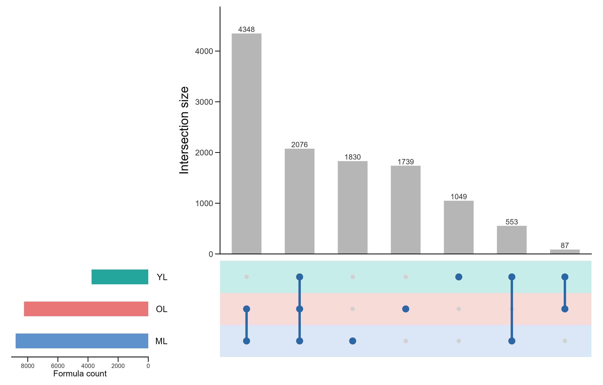

# FT-ICR DOM Analysis Skill

This repository contains Codex workflows and scripts for FT-ICR MS / DOM molecular formula analysis, PMD reaction summaries, Gephi network exports, and reusable publication-style figures.

## Skills and Commands

Use in Codex:

```text
$fticr-dom-analysis
```

Main commands/workflows:

- `molecular_property_analysis.py`: append molecular properties to FT-ICR MS formula tables.
- `molecular_PMD_analysis.py`: match PMD precursor/product reaction edges to molecular-property workbooks.
- `gephi_analysis.py`: generate Gephi-ready node and edge tables.
- `upset`: draw Raw FTICRMS YL/OL/ML formula-overlap UpSet figures.

## 1. Molecular Property Analysis

Script:

```text
scripts/molecular_property_analysis.py
```

Example commands:

```bash
python scripts/molecular_property_analysis.py input.xlsx output.xlsx
python scripts/molecular_property_analysis.py input.xlsx output.xlsx --sheet Sheet1
python scripts/molecular_property_analysis.py input.csv output.csv
```

The script reads `.csv`, `.xlsx`, or `.xls` formula tables, keeps the original columns, and appends:

```text
Delta G0cox
lambda
VK
(DBE-O)/C
```

It can use existing element columns (`C`, `H`, `N`, `O`, `S`, `P`, `Cl`, `Br`) or parse `MolForm` when element columns are absent.

## 2. PMD Reaction Matching

Script:

```text
scripts/molecular_PMD_analysis.py
```

Use this workflow after molecular-property workbooks and PMD network-edge tables have been generated.

Command:

```bash
python scripts/molecular_PMD_analysis.py processed
```

Typical outputs:

```text
source_reaction_matches/source_reaction_{tag}_matched_analysis.xlsx
target_reaction_matches/target_reaction_{tag}_matched_analysis.xlsx
source_reaction_matches/source_reaction_VK_Group_statistics.xlsx
target_reaction_matches/target_reaction_VK_Group_statistics.xlsx
```

## 3. Gephi Network Export

Script:

```text
scripts/gephi_analysis.py
```

Command:

```bash
python scripts/gephi_analysis.py processed --clean
```

Typical outputs:

```text
processed/gephi/nodes_{tag}_VK.xlsx
processed/gephi/nodes_{tag}_Group.xlsx
processed/gephi/network_edge{tag}_labeled.xlsx
```

## 4. `upset` Command

The `upset` workflow reproduces the Raw FTICRMS UpSet figure style used for YL, OL, and ML molecular formula overlap.

Script:

```text
scripts/upset.R
```

### Input

Place one Excel workbook per sample in the input directory. By default, the script expects:

```text
YL.xlsx
OL.xlsx
ML.xlsx
```

Each workbook must contain a column named:

```text
Formula
```

### Command

```bash
Rscript scripts/upset.R \
  --input_dir path/to/FTICRMS/Raw \
  --output_dir path/to/output \
  --prefix Raw_FTICRMS_UpSet \
  --sample_order YL,OL,ML \
  --width_in 7.2 \
  --height_in 4.6 \
  --dpi 600
```

On Windows PowerShell:

```powershell
& "C:\Program Files\R\R-4.5.2\bin\Rscript.exe" scripts\upset.R `
  --input_dir "C:\path\to\FTICRMS\Raw" `
  --output_dir "C:\path\to\output" `
  --prefix Raw_FTICRMS_UpSet `
  --sample_order YL,OL,ML `
  --width_in 7.2 `
  --height_in 4.6 `
  --dpi 600
```

### Outputs

The script writes editable vector graphics, high-resolution raster images, and source data:

```text
Raw_FTICRMS_UpSet.pdf
Raw_FTICRMS_UpSet.svg
Raw_FTICRMS_UpSet.png
Raw_FTICRMS_UpSet.tiff
Raw_FTICRMS_UpSet_intersection_sizes.csv
Raw_FTICRMS_UpSet_set_sizes.csv
Raw_FTICRMS_UpSet_formula_membership.csv
```

### Example Figure



Editable PDF example:

```text
assets/upset/Raw_FTICRMS_UpSet.pdf
```

### Style Rules Locked Into `upset`

- The lower matrix panel is aligned to the upper barplot coordinate space.
- `YL/OL/ML` row labels are drawn in a separate narrow label column so they do not change the matrix panel coordinate frame.
- Grey inactive points are drawn first; blue connector lines and active blue points are drawn above them.
- Visible axes and tick marks are black.
- The left set-size panel is positioned close to the row-label column.
- The default publication size is `7.2 x 4.6 in`.

### R Dependencies

Install the required R packages if they are not already available:

```r
install.packages(c(
  "readxl",
  "readr",
  "dplyr",
  "tidyr",
  "ggplot2",
  "patchwork",
  "ragg",
  "svglite"
))
```

## Notes

- The UpSet workflow uses formula presence/absence, not relative intensity.
- Formula identity is taken from the exact string in the `Formula` column.
- For manuscript figures, keep the exported `.svg` or `.pdf` as the editable master file.
